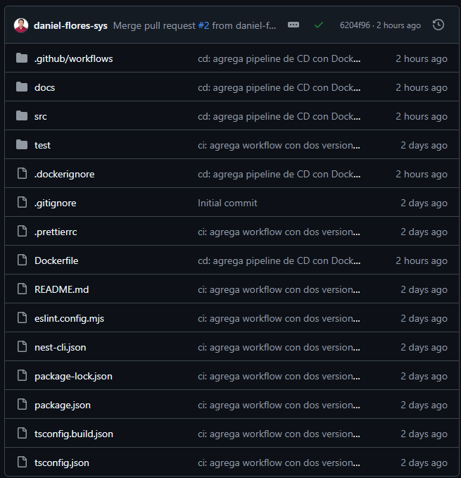
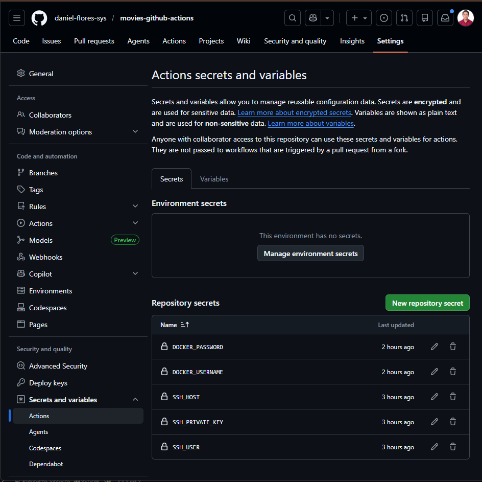
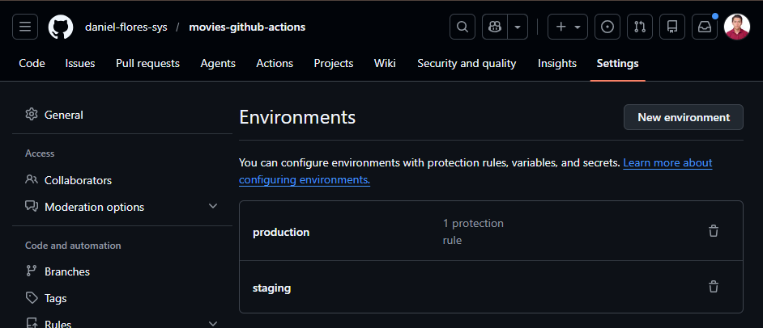
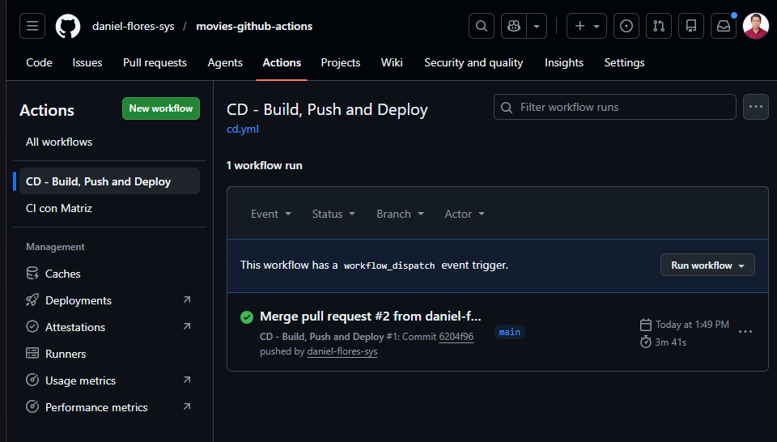
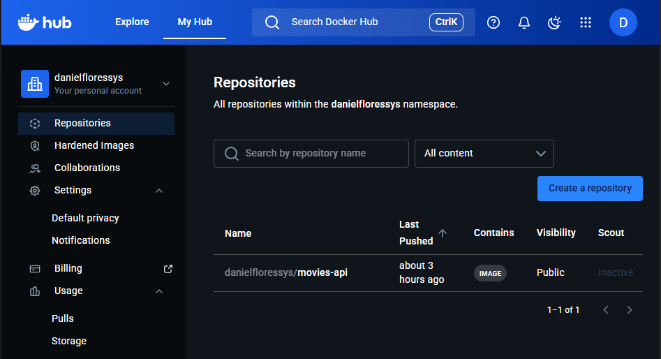
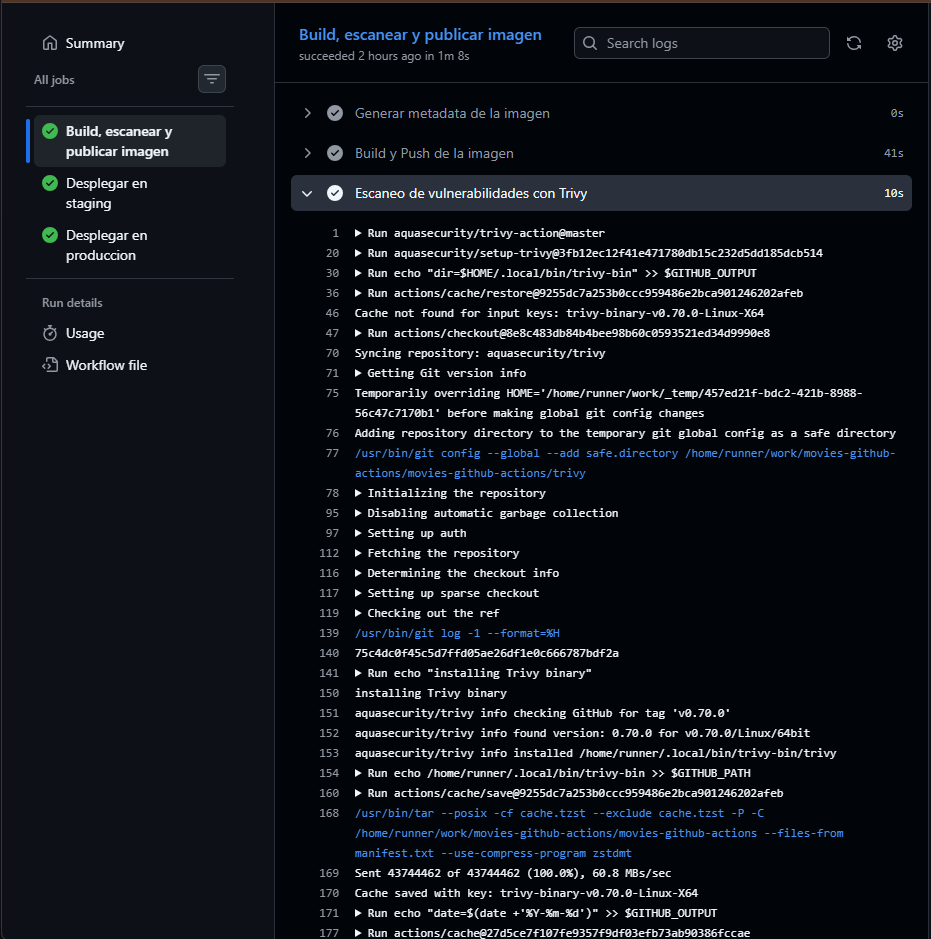
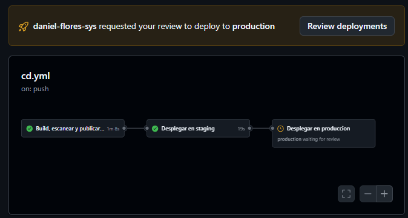
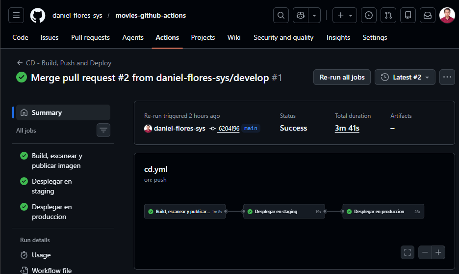
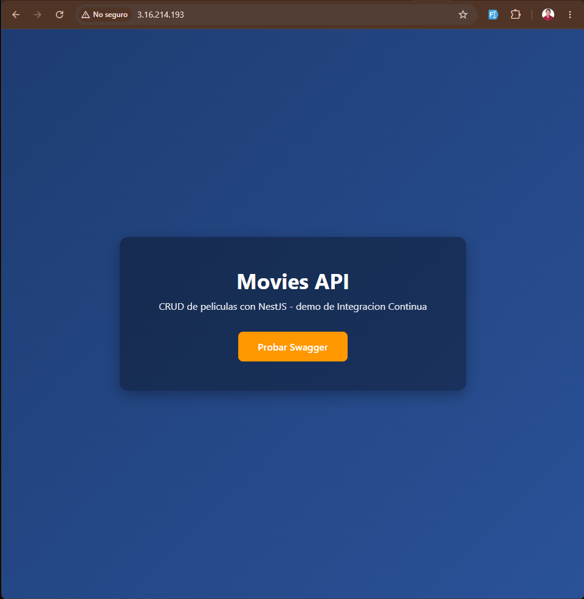
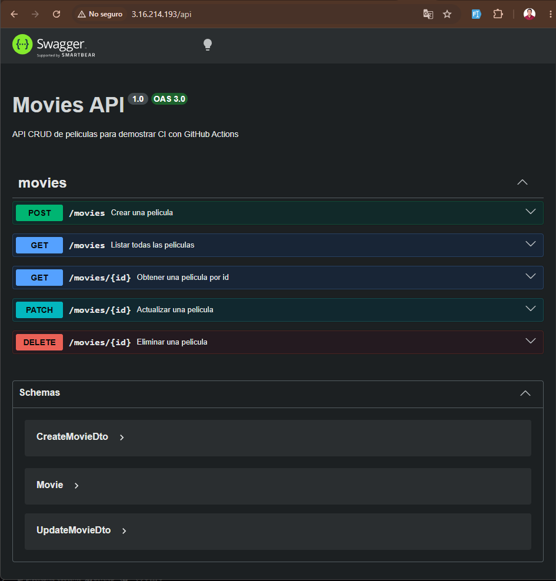

# Informe - Laboratorio 5.1: CI con GitHub Actions
## Erik Daniel Flores Medina
## Sistemas


## 1. Descripcion del Proyecto

**Repositorio:** `movies-github-actions`  
**Framework:** NestJS (TypeScript)  
**Persistencia:** Array en memoria  

### Aplicacion

API REST CRUD de peliculas con los siguientes endpoints:

| Metodo | Ruta         | Descripcion              |
|--------|--------------|--------------------------|
| GET    | `/`          | Landing page             |
| POST   | `/movies`    | Crear una pelicula       |
| GET    | `/movies`    | Listar todas             |
| GET    | `/movies/:id`| Obtener por id           |
| PATCH  | `/movies/:id`| Actualizar parcialmente  |
| DELETE | `/movies/:id`| Eliminar                 |
| GET    | `/api`       | Documentacion Swagger UI |

### Entidad Movie

```typescript
{
  id: number,     // autoincremental
  title: string,  // requerido, no vacio
  year: number    // requerido, entre 1888 y 2100
}
```

---

## 2. Pipeline de CI Configurado

El workflow se encuentra en `.github/workflows/ci.yml` y se activa ante eventos de `push` y `pull_request` sobre la rama `main`.

### Pasos del job `build-and-test`

1. **Checkout del codigo** — clona el repositorio.
2. **Configurar Node.js** — instala la version indicada por la matriz.
3. **Instalar dependencias** — `npm ci` (versiones exactas del `package-lock.json`).
4. **Ejecutar linting** — `npm run lint` (ESLint + Prettier).
5. **Ejecutar pruebas** — `npm test` (Jest, 18 pruebas unitarias + 4 e2e).

### Matriz de versiones

El pipeline corre en paralelo con **Node.js 20** y **Node.js 22**, generando dos jobs independientes por cada ejecucion.

---

## 3. Evidencias

### 3.1 Historial de ejecuciones en GitHub Actions

<!-- CAPTURA 1: Ir a la pestana "Actions" del repositorio en GitHub.
     La captura debe mostrar la lista de workflows ejecutados (runs), con sus
     iconos de estado: check verde (exitoso) y X roja (fallido).
     Se deben ver al menos 3 runs para mostrar el historial.
     Guardar como: docs/img/historial_actions.png -->


---

### 3.2 Detalle de un workflow exitoso con cobertura

<!-- CAPTURA 2: Hacer clic en un run exitoso (icono verde) en la pestana Actions.
     Luego entrar al job "build-and-test (20)" o "(22)".
     La captura debe mostrar todos los pasos en verde:
     - Checkout del codigo ✓
     - Configurar Node.js ✓
     - Instalar dependencias ✓
     - Ejecutar linting ✓
     - Ejecutar pruebas ✓
     Si expandes el paso "Ejecutar pruebas", debe verse el resumen de Jest
     con los tests pasando (ej: "18 passed, 18 total").
     Guardar como: docs/img/workflow_exitoso.png -->


<!-- CAPTURA 3 (complementaria): Con el paso "Ejecutar pruebas" expandido,
     mostrar el output de Jest con el numero de test suites y tests pasando.
     Guardar como: docs/img/workflow_exitoso_tests.png -->


---

### 3.3 Jobs paralelos por la matriz de Node.js

<!-- CAPTURA 4: Desde la vista del run exitoso (sin entrar a ningun job),
     mostrar la pantalla de "Jobs" donde se ven los dos jobs corriendo
     en paralelo: "build-and-test (20)" y "build-and-test (22)", ambos
     con icono verde.
     Guardar como: docs/img/jobs_paralelos.png -->


---

### 3.4 Workflow fallido por error de linting

<!-- CAPTURA 5: Despues de forzar un fallo intencionalmente (agregar una
     variable no usada en app.service.ts y hacer push), ir a la pestana
     Actions y hacer clic en el run que fallo (icono X rojo).
     La captura debe mostrar el paso "Ejecutar linting" marcado con X roja,
     y el mensaje de error de ESLint indicando la variable o regla violada.
     Guardar como: docs/img/workflow_fallido.png -->


---

### 3.5 Configuracion de la regla de proteccion de rama

<!-- CAPTURA 6: Ir a Settings > Branches del repositorio en GitHub.
     Mostrar la regla de proteccion creada sobre la rama "main" con:
     - "Require status checks to pass before merging" activado
     - Los checks "build-and-test (20)" y "build-and-test (22)" seleccionados
     Guardar como: docs/img/proteccion_rama.png -->


---

### 3.6 Pull Request bloqueado por CI fallida

<!-- CAPTURA 7: Abrir un Pull Request hacia main desde una rama de feature.
     Si el workflow falla (o aun esta en progreso), GitHub muestra un banner
     en el PR que dice "Some checks were not successful" o
     "Required status checks must pass before merging" y el boton de
     "Merge pull request" aparece deshabilitado o en rojo.
     La captura debe mostrar ese banner con los checks fallidos y el merge bloqueado.
     Guardar como: docs/img/pr_bloqueado.png -->


---

## 4. Conclusiones y Reflexion

### Por que la Integracion Continua es util en este proyecto

**Deteccion temprana de errores:** Cada `push` y `pull_request` ejecuta automaticamente el linting y las 22 pruebas (18 unitarias + 4 e2e). Si un cambio rompe alguna funcionalidad del CRUD, el equipo lo sabe antes de integrar el codigo a `main`.

**Consistencia entre entornos:** La matriz de Node.js 20 y 22 garantiza que la API funciona correctamente en distintas versiones del runtime, evitando el tipico problema de "en mi maquina funciona".

**Proteccion de la rama principal:** La regla de proteccion de rama impide que cualquier cambio defectuoso llegue a `main` sin pasar por el pipeline. Esto es especialmente valioso en equipos, donde multiples personas hacen `push` al mismo tiempo.

**Documentacion viva del estado del codigo:** El historial de runs en la pestana Actions funciona como un registro de la salud del proyecto a lo largo del tiempo.

**Confianza para refactorizar:** Con un pipeline que valida lint y pruebas en cada cambio, es posible refactorizar el codigo con la seguridad de que si algo se rompe, el workflow lo detectara antes de llegar a produccion.

---

*Laboratorio 5.1 — Trabajo en la Nube*

---
---

# Informe - Laboratorio 5.2: Pipeline de Despliegue Continuo con Docker

## 1. Descripcion del Pipeline de CD

A la API CRUD de peliculas del Laboratorio 5.1 se le agrega un pipeline de **Despliegue Continuo** que automatiza el ciclo completo:

1. **Build** de una imagen Docker multi-stage cuando se hace push a `main`.
2. **Escaneo de vulnerabilidades** sobre la imagen recien construida con Trivy.
3. **Push** de la imagen a Docker Hub etiquetada con el `SHA` del commit y como `latest`.
4. **Despliegue automatizado** sobre una instancia EC2 con health check y rollback automatico.
5. Promocion controlada entre dos **GitHub Environments**: `staging` y `production`.

### Decisiones tecnicas

| Decision | Justificacion |
|---|---|
| Dockerfile **multi-stage** (builder + runtime) | La imagen final solo incluye `dist/`, `node_modules` de produccion y `package.json`. Se descartan TypeScript, devDependencies y el codigo fuente, reduciendo el tamano y la superficie de ataque. |
| `npm prune --omit=dev` en la etapa de build | Elimina las dependencias de desarrollo despues de compilar, dejando un `node_modules` mas ligero para copiar a la imagen final. |
| Etiquetado con `github.sha` **y** `latest` | El SHA identifica de forma inmutable cada despliegue (clave para rollback), y `latest` facilita el `docker pull` cotidiano. |
| Endpoint **`/health`** retornando `{ status: 'ok', version: '1.0.0' }` | Permite que el script de despliegue valide que el contenedor nuevo arranco correctamente antes de exponerlo en el puerto 80. |
| Despliegue **blue/green simplificado** (puerto 3001 → 3000) | El contenedor nuevo arranca en el puerto 3001, se valida con `/health`, y solo si pasa se reemplaza al activo en el puerto 80. Si falla, la version anterior sigue sirviendo. |
| Dos **GitHub Environments** (`staging`, `production`) | Cada entorno tiene sus propios `Environment Secrets` (host SSH, usuario, llave). Production se configura con **Required reviewers** para aprobacion manual antes del deploy. |
| **Trivy** con `severity: CRITICAL,HIGH` y `exit-code: 0` | Reporta vulnerabilidades sin romper el pipeline durante el aprendizaje. En un proyecto real se subiria a `exit-code: 1` para bloquear builds inseguros. |

---

## 2. Archivos agregados al repositorio

### 2.1 `Dockerfile` (multi-stage)

```dockerfile
# Etapa 1: Build - compila TypeScript a JavaScript
FROM node:20-alpine AS builder
WORKDIR /app

COPY package*.json ./
RUN npm ci

COPY . .
RUN npm run build
RUN npm prune --omit=dev

# Etapa 2: Runtime - imagen final ligera
FROM node:20-alpine
WORKDIR /app

ENV NODE_ENV=production
ENV PORT=3000

COPY --from=builder /app/node_modules ./node_modules
COPY --from=builder /app/dist ./dist
COPY --from=builder /app/package*.json ./

EXPOSE 3000
CMD ["node", "dist/main.js"]
```

### 2.2 `.dockerignore`

Excluye `node_modules`, `.git`, `dist`, `coverage`, `docs`, `test`, archivos `.env`, configuracion de editor, etc. Esto acelera el `docker build` y evita filtrar secretos al contexto.

### 2.3 `.github/workflows/cd.yml`

Workflow con tres jobs encadenados:

- **`build-and-push`**: checkout → login Docker Hub → buildx → build & push (tags `${sha}` y `latest`) → escaneo Trivy.
- **`deploy-staging`** (`environment: staging`): SSH a la instancia de staging, deploy blue/green con health check.
- **`deploy-production`** (`environment: production`): se ejecuta solo si staging fue exitoso. Esta protegido por approval manual.

### 2.4 Endpoint `/health` agregado en `src/app.controller.ts`

```typescript
@Get('health')
getHealth(): { status: string; version: string } {
  return { status: 'ok', version: '1.0.0' };
}
```

---

## 3. Evidencias

### 3.1 Repositorio con los archivos de Docker

<!-- CAPTURA 1: Vista del repositorio en GitHub mostrando la raiz con
     Dockerfile, .dockerignore y .github/workflows/cd.yml visibles.
     Guardar como: docs/img/lab52_repo_archivos.png -->



---

### 3.2 Secretos y variables configurados en GitHub

<!-- CAPTURA 2: Settings > Secrets and variables > Actions.
     Mostrar los Repository secrets: DOCKER_USERNAME, DOCKER_PASSWORD,
     SSH_HOST, SSH_USER, SSH_PRIVATE_KEY.
     Guardar como: docs/img/lab52_secretos.png -->



---

### 3.3 GitHub Environments (staging y production)

<!-- CAPTURA 3: Settings > Environments. Mostrar los dos environments
     creados (staging y production), y dentro de production la regla de
     "Required reviewers" activada.
     Guardar como: docs/img/lab52_environments.png -->



---

### 3.4 Pipeline de CD ejecutandose - Build y Push

<!-- CAPTURA 4: Pestana Actions, run del workflow "CD - Build, Push and Deploy",
     job "build-and-push" con todos los pasos en verde:
     Checkout, Login Docker Hub, Setup Buildx, Build & Push, Trivy scan.
     Guardar como: docs/img/lab52_build_push.png -->



---

### 3.5 Imagen publicada en Docker Hub

<!-- CAPTURA 5: hub.docker.com, repositorio movies-api, mostrando los tags
     con el SHA del commit y "latest".
     Guardar como: docs/img/lab52_dockerhub.png -->



---

### 3.6 Escaneo de vulnerabilidades con Trivy

<!-- CAPTURA 6: Dentro del job "build-and-push", expandir el paso
     "Escaneo de vulnerabilidades con Trivy". Mostrar la tabla con
     vulnerabilidades CRITICAL y HIGH listadas (o "no vulnerabilities found").
     Guardar como: docs/img/lab52_trivy.png -->



---

### 3.7 Aprobacion manual para production

<!-- CAPTURA 7: El run del workflow esta detenido esperando aprobacion
     para el job deploy-production. Banner amarillo "Review pending
     deployments" con boton para aprobar.
     Guardar como: docs/img/lab52_approval.png -->



---

### 3.8 Despliegue exitoso en EC2 (deploy job)

<!-- CAPTURA 8: Job deploy-production con todos los pasos en verde.
     Expandir el output del SSH para que se vea el "Health check exitoso"
     y los comandos docker run.
     Guardar como: docs/img/lab52_deploy.png -->



---

### 3.9 API funcionando en la instancia EC2

<!-- CAPTURA 9: Navegador apuntando a http://IP_EC2/ mostrando la landing page
     o http://IP_EC2/health mostrando { "status": "ok", "version": "1.0.0" }.
     Guardar como: docs/img/lab52_app_ec2.png -->



<!-- CAPTURA 10: http://IP_EC2/api con Swagger UI funcionando.
     Guardar como: docs/img/lab52_swagger_ec2.png -->



---

## 4. Procedimiento de Rollback

Como cada imagen se etiqueta con el `SHA` del commit que la origino, el rollback es trivial: basta con saber el SHA del despliegue anterior (visible en el historial de Actions o en Docker Hub) y reemplazar el contenedor activo.

```bash
# Conectarse al servidor EC2
ssh -i clave.pem ubuntu@IP_EC2

# Reemplaza SHA_ANTERIOR por el SHA del commit estable
SHA_ANTERIOR=abc1234...
IMAGE="USUARIO_DOCKERHUB/movies-api:${SHA_ANTERIOR}"

docker pull $IMAGE
docker stop movies-api
docker rm movies-api
docker run -d \
  --name movies-api \
  --restart unless-stopped \
  -p 80:3000 \
  $IMAGE
```

En menos de un minuto la API vuelve a la version estable, sin necesidad de revertir commits ni volver a correr todo el pipeline. Combinado con el **health check del deploy**, que ya evita publicar versiones rotas, el riesgo de tener un downtime prolongado se reduce drasticamente.

---

## 5. Reflexion sobre contenedores y despliegue continuo

**Paridad entre entornos.** El Dockerfile garantiza que la imagen que paso el escaneo de vulnerabilidades y el job de build es exactamente la misma que corre en staging y en produccion. Desaparece el clasico "funcionaba en mi maquina" porque el binario es el mismo bit a bit.

**Despliegues seguros por defecto.** El patron blue/green simplificado (3001 → 80) combinado con el endpoint `/health` significa que un build roto **nunca llega a los usuarios finales**: el script aborta antes de tocar el contenedor activo. Antes de Docker + GitHub Actions, este nivel de seguridad requeria configurar un load balancer manualmente.

**Rollback en segundos.** Etiquetar cada imagen con el `SHA` convierte cada despliegue en un punto de restauracion. Un bug detectado tres horas despues del deploy se revierte con tres comandos en SSH, no con un commit de revert + ejecutar el pipeline completo de nuevo.

**Aprobaciones humanas donde importan.** GitHub Environments permite que staging se despliegue automaticamente para validar cambios, pero exige aprobacion manual para production. Es el equilibrio correcto entre velocidad de iteracion y control.

**Seguridad como parte del pipeline.** Integrar Trivy en el flujo hace que las vulnerabilidades de las dependencias de produccion sean visibles en cada commit, no en una auditoria semestral. Es un cambio cultural: la seguridad deja de ser un cuello de botella y se vuelve parte del feedback diario del equipo.

En conjunto, contenedores + CD reducen el costo de equivocarse. Y cuando equivocarse es barato, el equipo puede iterar mas rapido y con mas confianza, que es justamente el objetivo de cualquier proyecto en la nube.

---

*Laboratorio 5.2 — Trabajo en la Nube*
