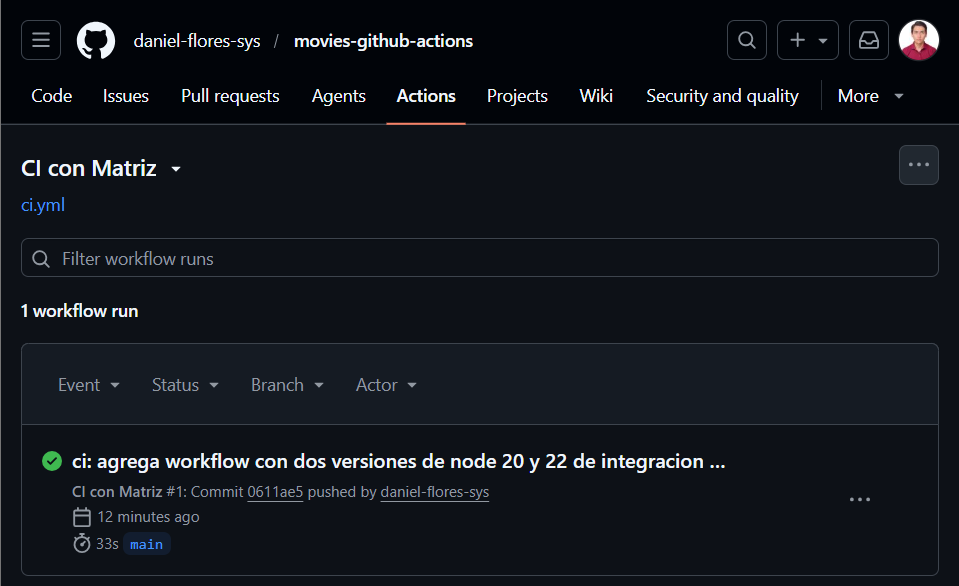
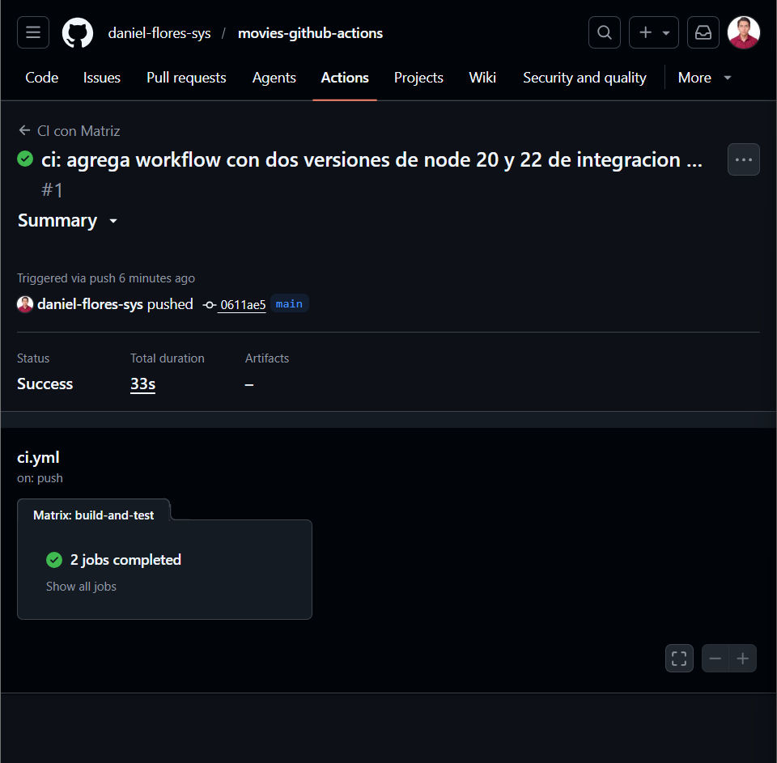
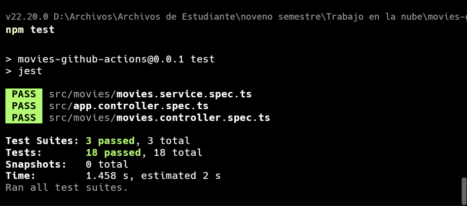
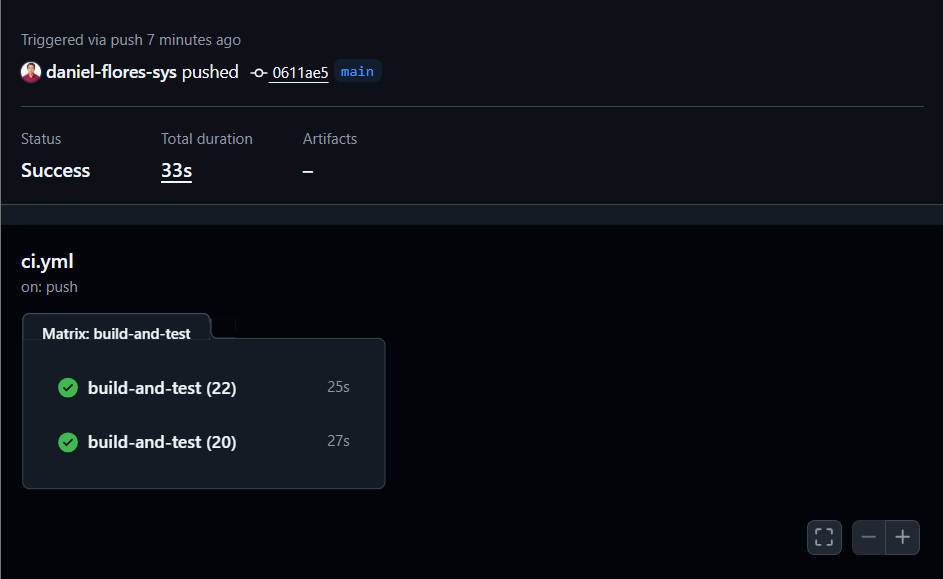
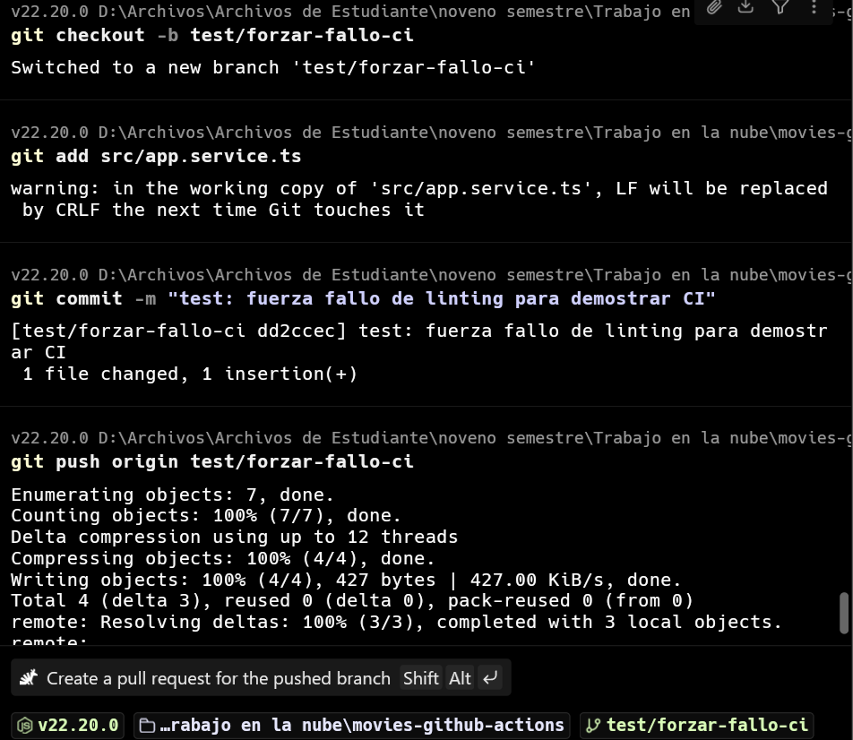
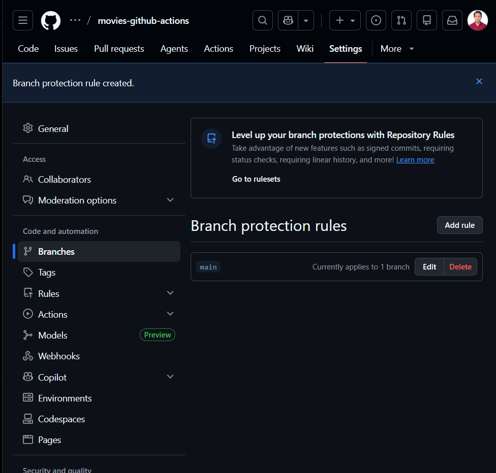
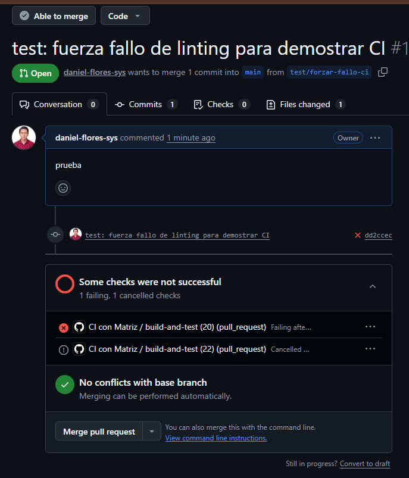

# Informe - Laboratorio 5.1: CI con GitHub Actions
## Erik Daniel Flores Medina
## Sistemas


## 1. Descripcion del Proyecto

**Repositorio:** `movies-github-actions`  
**Framework:** NestJS (TypeScript)  
**Persistencia:** Array en memoria  

### Aplicacion

API REST CRUD de peliculas con los siguientes endpoints:

| Metodo | Ruta         | Descripcion              |
|--------|--------------|--------------------------|
| GET    | `/`          | Landing page             |
| POST   | `/movies`    | Crear una pelicula       |
| GET    | `/movies`    | Listar todas             |
| GET    | `/movies/:id`| Obtener por id           |
| PATCH  | `/movies/:id`| Actualizar parcialmente  |
| DELETE | `/movies/:id`| Eliminar                 |
| GET    | `/api`       | Documentacion Swagger UI |

### Entidad Movie

```typescript
{
  id: number,     // autoincremental
  title: string,  // requerido, no vacio
  year: number    // requerido, entre 1888 y 2100
}
```

---

## 2. Pipeline de CI Configurado

El workflow se encuentra en `.github/workflows/ci.yml` y se activa ante eventos de `push` y `pull_request` sobre la rama `main`.

### Pasos del job `build-and-test`

1. **Checkout del codigo** — clona el repositorio.
2. **Configurar Node.js** — instala la version indicada por la matriz.
3. **Instalar dependencias** — `npm ci` (versiones exactas del `package-lock.json`).
4. **Ejecutar linting** — `npm run lint` (ESLint + Prettier).
5. **Ejecutar pruebas** — `npm test` (Jest, 18 pruebas unitarias + 4 e2e).

### Matriz de versiones

El pipeline corre en paralelo con **Node.js 20** y **Node.js 22**, generando dos jobs independientes por cada ejecucion.

---

## 3. Evidencias

### 3.1 Historial de ejecuciones en GitHub Actions

<!-- CAPTURA 1: Ir a la pestana "Actions" del repositorio en GitHub.
     La captura debe mostrar la lista de workflows ejecutados (runs), con sus
     iconos de estado: check verde (exitoso) y X roja (fallido).
     Se deben ver al menos 3 runs para mostrar el historial.
     Guardar como: docs/img/historial_actions.png -->



---

### 3.2 Detalle de un workflow exitoso con cobertura

<!-- CAPTURA 2: Hacer clic en un run exitoso (icono verde) en la pestana Actions.
     Luego entrar al job "build-and-test (20)" o "(22)".
     La captura debe mostrar todos los pasos en verde:
     - Checkout del codigo ✓
     - Configurar Node.js ✓
     - Instalar dependencias ✓
     - Ejecutar linting ✓
     - Ejecutar pruebas ✓
     Si expandes el paso "Ejecutar pruebas", debe verse el resumen de Jest
     con los tests pasando (ej: "18 passed, 18 total").
     Guardar como: docs/img/workflow_exitoso.png -->



<!-- CAPTURA 3 (complementaria): Con el paso "Ejecutar pruebas" expandido,
     mostrar el output de Jest con el numero de test suites y tests pasando.
     Guardar como: docs/img/workflow_exitoso_tests.png -->



---

### 3.3 Jobs paralelos por la matriz de Node.js

<!-- CAPTURA 4: Desde la vista del run exitoso (sin entrar a ningun job),
     mostrar la pantalla de "Jobs" donde se ven los dos jobs corriendo
     en paralelo: "build-and-test (20)" y "build-and-test (22)", ambos
     con icono verde.
     Guardar como: docs/img/jobs_paralelos.png -->



---

### 3.4 Workflow fallido por error de linting

<!-- CAPTURA 5: Despues de forzar un fallo intencionalmente (agregar una
     variable no usada en app.service.ts y hacer push), ir a la pestana
     Actions y hacer clic en el run que fallo (icono X rojo).
     La captura debe mostrar el paso "Ejecutar linting" marcado con X roja,
     y el mensaje de error de ESLint indicando la variable o regla violada.
     Guardar como: docs/img/workflow_fallido.png -->



---

### 3.5 Configuracion de la regla de proteccion de rama

<!-- CAPTURA 6: Ir a Settings > Branches del repositorio en GitHub.
     Mostrar la regla de proteccion creada sobre la rama "main" con:
     - "Require status checks to pass before merging" activado
     - Los checks "build-and-test (20)" y "build-and-test (22)" seleccionados
     Guardar como: docs/img/proteccion_rama.png -->



---

### 3.6 Pull Request bloqueado por CI fallida

<!-- CAPTURA 7: Abrir un Pull Request hacia main desde una rama de feature.
     Si el workflow falla (o aun esta en progreso), GitHub muestra un banner
     en el PR que dice "Some checks were not successful" o
     "Required status checks must pass before merging" y el boton de
     "Merge pull request" aparece deshabilitado o en rojo.
     La captura debe mostrar ese banner con los checks fallidos y el merge bloqueado.
     Guardar como: docs/img/pr_bloqueado.png -->



---

## 4. Conclusiones y Reflexion

### Por que la Integracion Continua es util en este proyecto

**Deteccion temprana de errores:** Cada `push` y `pull_request` ejecuta automaticamente el linting y las 22 pruebas (18 unitarias + 4 e2e). Si un cambio rompe alguna funcionalidad del CRUD, el equipo lo sabe antes de integrar el codigo a `main`.

**Consistencia entre entornos:** La matriz de Node.js 20 y 22 garantiza que la API funciona correctamente en distintas versiones del runtime, evitando el tipico problema de "en mi maquina funciona".

**Proteccion de la rama principal:** La regla de proteccion de rama impide que cualquier cambio defectuoso llegue a `main` sin pasar por el pipeline. Esto es especialmente valioso en equipos, donde multiples personas hacen `push` al mismo tiempo.

**Documentacion viva del estado del codigo:** El historial de runs en la pestana Actions funciona como un registro de la salud del proyecto a lo largo del tiempo.

**Confianza para refactorizar:** Con un pipeline que valida lint y pruebas en cada cambio, es posible refactorizar el codigo con la seguridad de que si algo se rompe, el workflow lo detectara antes de llegar a produccion.

---

*Laboratorio 5.1 — Trabajo en la Nube*
